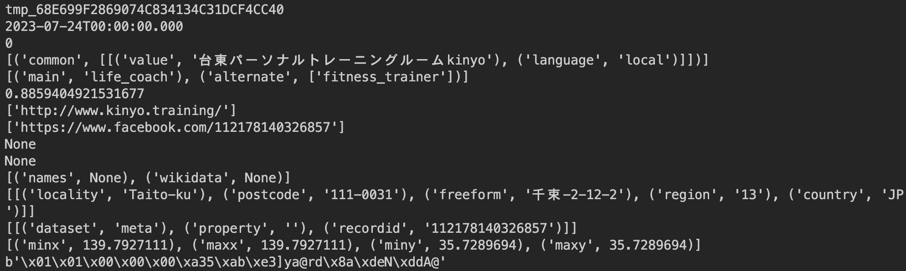

# Processing Overture

- Processing Overture data.

# Requirement: Download data

- We need download place data. The below list shows the downloaded files at `~/data/Overture/type=place`:

```txt
20230725_210643_00079_ayc64_01c760ca-02aa-4387-8b71-b2eaa6c7c700
20230725_210643_00079_ayc64_023fe3f2-d72a-40b6-9eb9-4bb1b61664d6
20230725_210643_00079_ayc64_15b8943c-63b7-45c8-99fd-82a63affb530
20230725_210643_00079_ayc64_2088ce07-cd07-4188-86f9-70ddc600d953
20230725_210643_00079_ayc64_25c9ad4f-9c04-4485-b77c-6b707e574bc3
20230725_210643_00079_ayc64_3ea51517-e19f-4b0d-abdf-4bb0adf93b2c
20230725_210643_00079_ayc64_3eb62b69-1e51-4418-b040-f20dec443529
20230725_210643_00079_ayc64_406f76e6-8475-45dd-9890-96158149ebf7
20230725_210643_00079_ayc64_42983b77-e638-4365-9748-44be3a463021
20230725_210643_00079_ayc64_536928b2-b04d-4a92-ba02-6efdf7090119
20230725_210643_00079_ayc64_5b7efef7-f232-4442-a3f9-cf7d40ad0322
20230725_210643_00079_ayc64_623f786a-63e9-4f7e-8ea4-907626c0b2e6
20230725_210643_00079_ayc64_65bc6681-e96f-4a69-9e07-410e452d6ad2
20230725_210643_00079_ayc64_75db186a-38c6-4a41-9d3e-ce5e012da76f
20230725_210643_00079_ayc64_7a0b789f-05cf-4f8f-9b98-46563a81a942
20230725_210643_00079_ayc64_7ea6ab77-85f8-435d-b73c-2f30a026ada0
20230725_210643_00079_ayc64_85b0d784-b3d7-44d9-a50c-402f7c5d56da
20230725_210643_00079_ayc64_8e9ef564-7a2f-42d4-97b6-3ca77ec830e8
20230725_210643_00079_ayc64_923feef3-e974-4379-ab12-19bf41bc42fc
20230725_210643_00079_ayc64_95042c29-0438-46c4-ad60-cacf42ccf6c7
20230725_210643_00079_ayc64_95413b43-f25f-4b90-984e-00e32521c511
20230725_210643_00079_ayc64_973e6f70-8037-465c-bfb6-a29db6491710
20230725_210643_00079_ayc64_a38d99ff-b93e-47f7-ac74-7554958822d5
20230725_210643_00079_ayc64_ae5a4c6e-2a1a-48bb-b621-f8820faf5dd8
20230725_210643_00079_ayc64_b2a9472e-e6f9-4060-a272-35c0571e75b9
20230725_210643_00079_ayc64_c089686d-4a53-42b3-95d4-071ffacc191d
20230725_210643_00079_ayc64_c28a03b6-2f0d-468d-a9d7-fd655afbd04d
20230725_210643_00079_ayc64_d1281c94-aacc-42ae-8852-905117201521
20230725_210643_00079_ayc64_d2488fa7-c51b-4fca-b6f4-168af8fbf9fa
20230725_210643_00079_ayc64_fa803010-a326-4119-8d5a-c4d9173205a7
```

- We need two directories: `indices` and `tables` to generate CSV files after filtering places in parquet files.


# How to run

- To save indices (i.e., index of places in `shape` file), just run:

```
./get_all_index.sh
```

- To generate separated CSV files, just run:

```
./get_all_table.sh
```

- Simple parsers/converters written in Python are saved in `src/`.
- Scatter plots of extracted POIs are saved in `figures/`.


# Related articles (in Japanese)

- https://zenn.dev/takilog/articles/b2c588753fb3aa
- An example of data is here:

